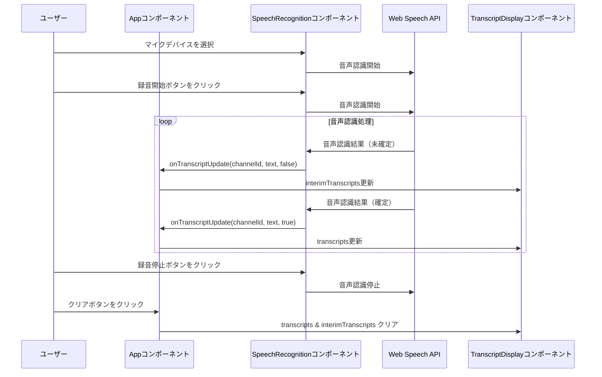
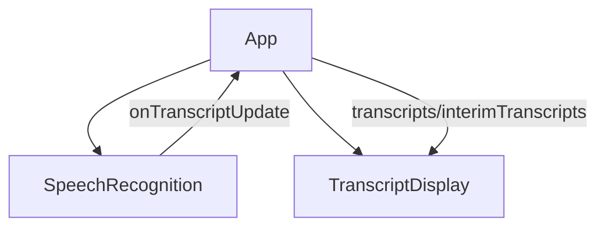
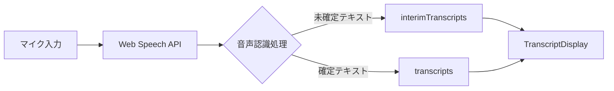

# 2チャンネル同時音声認識アプリ

このプロジェクトは、Web Speech Recognition APIを使用して2つの異なるマイク入力から同時に音声認識を行い、文字起こしを表示するReactアプリケーションです。

## 概要

このアプリケーションは以下の機能を提供します：

- 2つの異なるマイク入力からの同時音声認識
- リアルタイムでの文字起こし表示（確定/未確定テキスト）
- 各チャンネルごとの文字起こし結果の表示
- 文字起こし結果のクリア機能

## システム構成

アプリケーションは以下のコンポーネントで構成されています：

- **App**: メインアプリケーションコンポーネント
- **SpeechRecognition**: 音声認識機能を提供するコンポーネント
- **TranscriptDisplay**: 文字起こし結果を表示するコンポーネント

## シーケンス図

以下は、音声認識処理のシーケンス図です：

## コンポーネント図

アプリケーションのコンポーネント構造は以下の通りです：

## データフロー

## 技術スタック

- React 19.0.0
- TypeScript 4.9.5
- Web Speech Recognition API
- Create React App

## 使用方法

1. アプリケーションを起動します
2. 各チャンネルのマイクデバイスを選択します
3. 「録音開始」ボタンをクリックして音声認識を開始します
4. 話した内容がリアルタイムで文字起こしされます
5. 「録音停止」ボタンをクリックして音声認識を停止します
6. 「文字起こし結果をクリア」ボタンで結果をクリアできます

## 注意事項

- Web Speech Recognition APIはブラウザによってサポート状況が異なります
- 最新のChrome、Edge、Safariでの使用を推奨します
- 確定した文字起こし結果のみ保持されます
